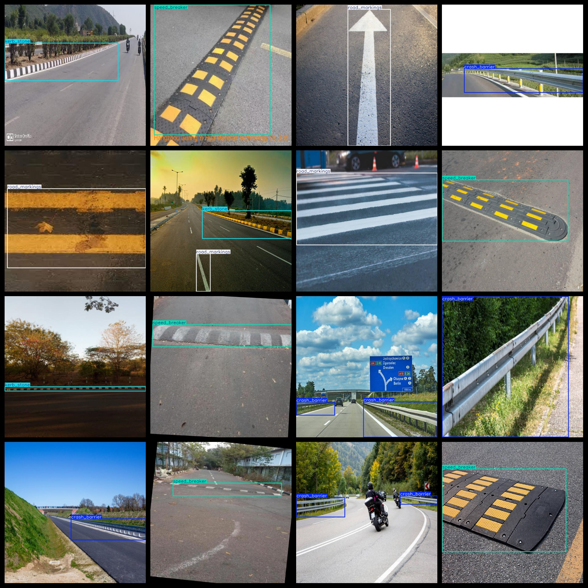
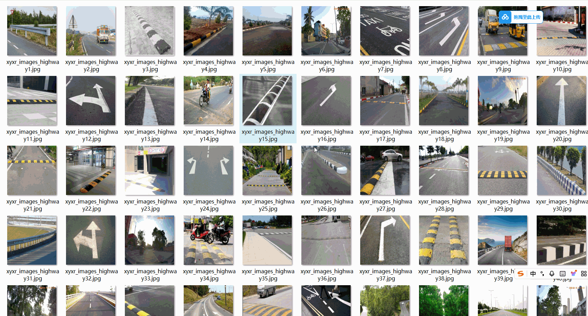

# [Object Detection] 4-class Road Transport Facilities Dataset - 1135 Images in YOLO+VOC format

[Object Detection] 4-class Road Transport Facilities Dataset - 1135 Images in YOLO+VOC format

Dataset format: VOC format + YOLO format

The package contains three folders, each storing images, xml, and txt files.

The JPEGImages folder contains a total of 1135 jpg images.

The Annotations folder contains a total of 1135 xml files.

The labels folder contains a total of 1135 txt files.

Number of labels: 4

Label names: ["crash_barrier", "kerb_stone", "road_markings", "speed_breaker"]

Label names: [“Defender vehicle”，“Lane edge stone”，“Road markings”，“Speed reduction strip”]

Each label has the following number of boxes (note that the order in the YOLO format is different from this, but it is based on the classes.txt in the labels folder):

crash_barrier boxes = 348

kerb_stone boxes = 352

road_markings boxes = 353

speed_breaker boxes = 340

Total boxes: 1393

Image resolution: Clear

Image enhancement: No

Label shape: A rectangular box used for target detection recognition

Important note: No guarantees are made regarding the accuracy or weights of the trained models using this dataset. The dataset only provides accurate and reasonable annotations.

Annotations and image details are as follows:
## Images

---

Here is a pay link on Stripe (https://buy.stripe.com/3cs8yP7sY87d0vu9AB). Please contact me lonlonago@foxmail.com after funding $89, and I will send you a complete data files, thank you!

